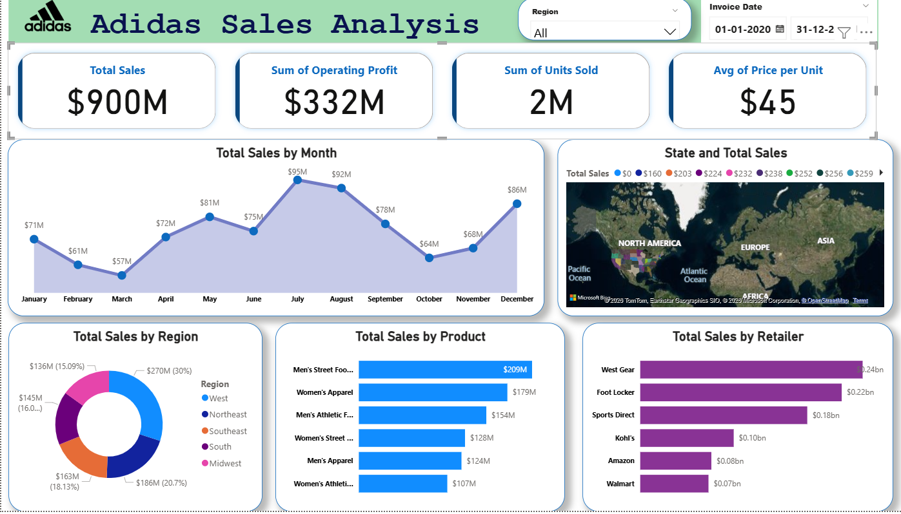

# 📊 Adidas Sales Dashboard

---

## 📸 Dashboard Preview 

> 💡 *Tip: Add multiple screenshots if needed to show different views.*

---

## 📌 Overview
The **Adidas Sales Dashboard** provides a comprehensive view of sales performance, enabling users to track, analyze, and derive insights from key business metrics. It is designed to help stakeholders understand trends, regional performance, and product-level contributions.

---

## 🚀 Features
- **Total Sales** – Overall revenue generated خلال the selected period  
- **Operating Profit** – Total profit after operating expenses  
- **Units Sold** – Total number of products sold  
- **Average Price per Unit** – Insight into pricing efficiency  

---

## 📈 Visualizations

### 1. Area Chart
- Displays total sales by month  
- Helps identify trends and seasonality  

### 2. Map Visualization
- Shows sales distribution by state  
- Highlights high- and low-performing regions  

### 3. Bar Chart – Sales by Product
- Compares performance across products  
- Identifies top and underperforming items  

### 4. Bar Chart – Sales by Retailer
- Shows contribution of each retailer  
- Helps evaluate partner performance  

### 5. Donut Chart – Sales by Region
- Provides a quick breakdown of regional sales distribution  

---

## 🎛️ Filters (Slicers)
- **Region Slicer** – Filter data by specific regions  
- **Invoice Date Slicer** – Analyze sales across custom time periods  

---

## 📂 Data Source
The dashboard uses Adidas sales data, including:
- Product details  
- Sales regions  
- Units sold  
- Revenue and pricing information  

This dataset enables multi-dimensional analysis across time, geography, and product categories.

---

## ⚙️ Requirements
- **Power BI Desktop** (May 2024 version or later recommended)  
- No additional dependencies required  

---

## 🧑‍💻 Usage

### 1. Open the Dashboard
Download the `.pbix` file and open it using Power BI Desktop.

### 2. Interact with Data
- Use slicers to filter by region or date  
- Hover over visuals for detailed tooltips  

### 3. Customize
- Modify filters and visuals  
- Explore different dimensions and metrics  

---

## 💡 Key Insights
- Monthly trends reveal peak sales periods and slow seasons  
- Geographic analysis highlights strong markets  
- Product and retailer charts identify key contributors  
- Regional distribution offers quick performance comparison  

---

## 🔮 Future Enhancements
- Add advanced time filters (year/quarter selection)  
- Include additional KPIs such as:
  - Customer Satisfaction  
  - Profit Margin by Region  

---

## 📎 Author
Krish Shah 

---

## ⭐ Contributing
Feel free to fork this repository and submit pull requests for improvements.

---

## 📜 License
This project is open-source and available under the MIT License.
